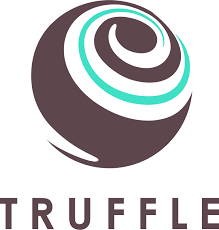
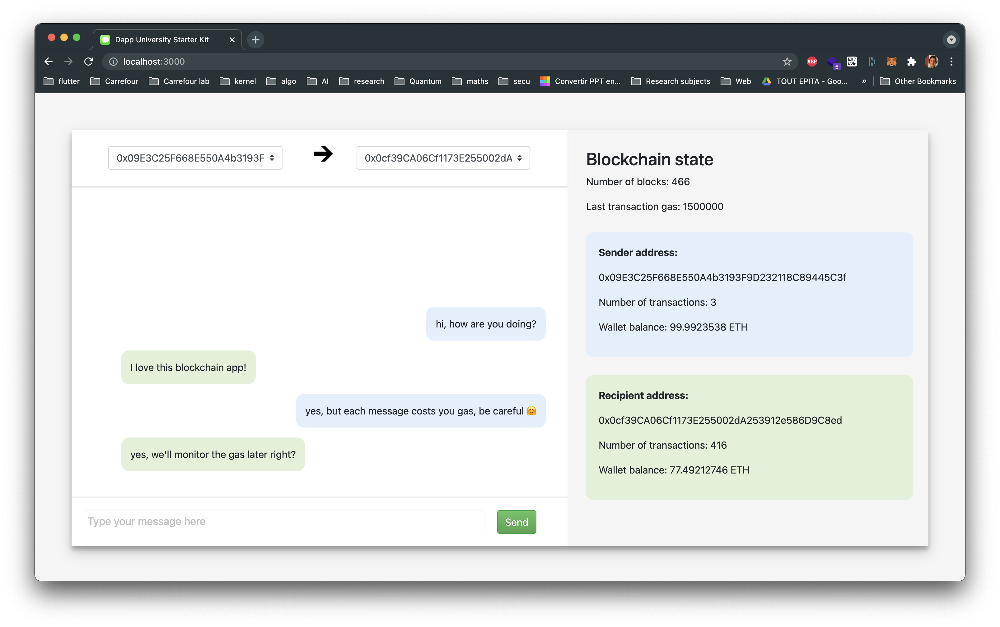

# blockchain-chat-app
Simple Ethereum blockchain app for messaging and ether sending between Ganache addresses.

## Stack
|  |    |  |
|---|---|---|
  
## UI    


## Deploy
You first need to run Ganache on localhost:7545, install metamask in the browser, install dependencies and finally fire the react server.
```
npm install
npm run start
```

## Features
* connect to all the available wallet addresses available in Ganache
* send messages between these addresses
* store all the messages in the smart contract in order to fetch them back when the page is reloaded
* monitor the state of the blockchain in real time when the transactions are executed
* send ethereum between the addresses
